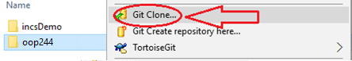

# OOP244 Workshops

# Computer preparation and Getting Workshop files

## Setting up your computers for OOP244

Installation guides for preparing your computer for the subject can be found in this playlist on YouTube:<br />
["How-to" videos for C/C++ Core subjects](https://www.youtube.com/playlist?list=PLxB4x6RkylosAh1of4FnX7-g2fk0MUeyc)<br />
OR:<br />
Go to this url: https://tinyurl.com/244setup 


## Getting Workshop files
(if you have not followed the Installation guides to prepare your computer go to **Using [Download Zip](#using-download-zip)**)<br />

### Using [Git](https://git-scm.com/download/win)
- Open https://github.com/Seneca-244200/OOP-Workshops and click on “Code” Button; this will open “Clone with HTTPS” window.<br />

> If the window is titled “Clone with SSH” then click on “Use HTTPS”: <br />

- Copy the https URL by clicking on the button on the right side of the URL:<br />
- Open File Explorer on your computer and select or create a directory for your workshops. 
> Make sure this directory is not a git repository. **You can not clone a repository inside another repository** 

#### Using [ToroiseGit](https://tortoisegit.org/download/)
- Right click on the selected directory and select “Git Clone":<br /> <br />
-This will open the “Git Clone” window with the URL already pasted in the “URL” text box; if not, paste the URL manually:<br /> <br />
- Click on ok<br />
This will create on your computer a clone (identical directory structure) of the directory on Github.  Once you have cloned the directory, you can open the workshop directory **OOP-Workshops/WS??** and copy it to your own separate local directory and start doing your workshop. Note that the cloning process is done only once. The next time when a new workshop is released, all you need to do is to `pull` the repository to download all the changes.
> If your professor makes any changes to the workshop or a new workshop is released, you can right click on the cloned repository directory and select **Tortoise Git/pull** to update and sync your local workshops repository to the one on Github with-out having to download it again. Note that this will only apply the changes made and will not affect any work that you have done on your workshop.
#### Using Command line
- Open the git command line on your computer.
- Change the directory to your workshops directory.
- Issue the following command at the command prompt in your workshops directory: 
``` bash
git clone https://github.com/Seneca-244200/OOP-Workshops.git<ENTER>
```
> The URL for all the workshops are the same throughout the semester. The only thing that changes, is the workshop number.<br/>

This will create on your computer a clone (identical directory structure) of the directory on Github.  Once you have cloned the directory, you can open the workshop directory **OOP-Workshops/WS??** and copy it to your own separate local directory and start doing your workshop. Note that the cloning process is done only once. The next time when a new workshop is released, all you need to do is to `pull` the repository to download all the changes.

> If your professor makes any changes to the workshop, you can issue the command

``` bash 
git pull<ENTER>
``` 

>  in the cloned repository directory to update and sync your local workshop to the one on Github without having to download it again. Note that this will only apply the changes made and will not affect any work that you have done on your workshop.

#### Using Download ZIP
- Open https://github.com/Seneca-244200/OOP-Workshops  and click on “Code” button and click on “Download ZIP”.<br />
<br />
- This will download a zipped file copy of the workshop repository from Github to your computer. You can extract this file to where you want to do your workshop. <br />
> Note that, if your professor makes any changes to the workshop, to get them you have to separately download another copy of entire workshop repository and manually apply the changes to your working directory to **make sure nothing of your work is overwritten by mistake**.


# Important Notes

## How to Use Cloned Workshops or Project Repositories (quick list)

When you clone a Workshops or Project repository to your computer, follow these steps to work on a specific workshop or milestone:

1. **Clone the Repository:** *(This should be done once at the beginning of the semester)* <br />First, clone the desired repository to your local machine using Git.
2. **Create Your Own Working Directory or use your own private Git repository:** <br />Instead of modifying the files directly within the cloned repository, create your own private working directory or repository (lets call it `oop244_works`). This ensures that your changes won’t conflict with the original repository. <br />
Here’s how:
    - Create or locate your OOP244 school work folder or repository on your computer
    - **Create a new folder** (directory) in `oop244_works` where you’ll work on the workshop or milestone.
    - **Copy the relevant files** or directories from the cloned repository into your new working directory.
    - **Make Changes in Your Working Directory:** Now that you have your own copy of the workshop or milestone, feel free to make changes, add code, or update content as needed. You won’t affect the original repository this way.
    - **Commit and Push Changes:** If you are working in your own repository, as you work, commit your changes to your local Git repository and push them to your remote repository on GitHub. 
    > This could be a repository with your professor added as a collaborator so you can easily ask for help and advice without the need to send or share files (see [setting up your computer](#setting-up-your-computers-for-oop244))
3. **Pull Changes from the Original Repository:** Occasionally, the original repository may receive updates, improvements or posting of new workshops. To incorporate these changes into your working directory, follow these steps:
    - **Pull** the latest changes from the original repository.
    - **Copy the changes to the workshop or milestone** to your working directory <br /> OR <br />Go to step 2 if a new workshop is released
    - **Commit and push** the changes in your own repository
4. **Continue Working!:** With your own working directory set up, you can now continue working on the workshop or milestone without affecting the original repository.<br />

5. **Submit your code to be marked:**
    - If you are using a private repository, you can also clone it on Matrix and when the work is done, committed and pushed, you can simple login to matrix, pull the repository,  and submit it the pulled work.
    - If you are working in a simple directory, Use SFTP to upload your work (IN TEXT MODE) to matrix and submit it. 
    
> Remember to always copy the new workshop or milestone out of the cloned repository into your own working directory before making changes. This practice ensures a clean separation between your work and the shared repository.

Happy studying and coding! 🚀👩‍💻👨‍💻

## VPN
- Install [GlobalProtect VPM](https://students.senecapolytechnic.ca/spaces/186/it-services/wiki/view/1024/vpn) on your computer to have access to internal services of Seneca and the Matrix Linux cluster.
- If transferring program files to Matrix using an SFTP or SSH client, make sure your transfer mode is always set to **TEXT**
