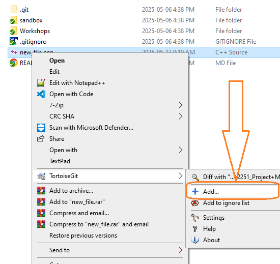
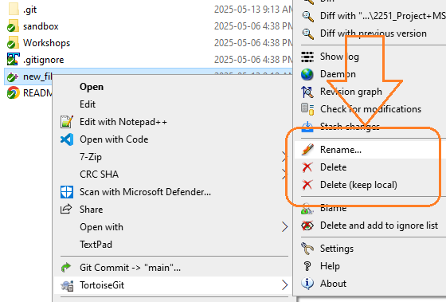

# Workshop #0 (ZERO): Computer and GitHub Account Preparation for Coding and Collaboration
### Version 1.0.  The submission is open
### Version 1.1.  [Added important file management commands using Git](#important-git-commands)

---

In this initial workshop, you will install and configure the software needed to help you code, debug, and collaborate using the C++ language.

### Learning Outcomes

Upon successful completion of this workshop, you will:

* Install Git on your computer
* Create a private repository in your personal GitHub account
* Add your professor as a collaborator to your private repository
* Modify the `.gitignore` and `readme.md` files in your repository
* Create SSH keys on your computer and in your Matrix account to access your GitHub account
* Install Visual Studio on your PC or Xcode on your Mac
* Clone your private repository to your computer
* Clone your private repository to Matrix
* Write a program that prints your student ID and your private repository path, and test it
* Commit your program to your private repository on your computer
* Push the program upstream to GitHub
* Pull the program down to Matrix
* Submit your program using the submitter program on Matrix
* Learn how to add, delete, rename/move the files tracked by git

## Submission Policy and Instructions

This workshop is divided into two sections: an installation / coding part  and a reflection 


1. (**LAB**): A step-by-step guided workshop, worth 100% of the workshop’s total mark.
> Please note that Part 1 **is not** to be started in your lab session of the week. You should start it on your own before the day of your lab and then join the lab session to possibly seek assistance to complete your lab. These workshops must be submitted in the lab to receive 100% of the mark.

2. Reflection: A non-coding part, to be submitted a few days later (due date decided by your professor). The reflection doesn’t have marks associated with it but can incur a penalty of up to 40% of the whole workshop’s mark if your professor deems it insufficient (you make your marks from the code, but you can lose some on the reflection).

## Due Dates
### Installation and Coding
installation and coding is due by the end of your lab session and is to be submitted from one of the desktop computers in the lab for 100% of the mark. You will receive 60% of the mark if you submit your code after the lab by midnight. No submissions are accepted after that.

## Late Penalties
You are allowed to submit your workshop by midnight on the same day of your lab session with a 40% penalty. No submission is accepted after that.


# Workshop Zero: Windows instructions  [Go to Apple instructions](#mac-apple-instructions)

## PuTTY installation
PuTTY is a free and lightweight terminal emulator that lets you remotely connect to other computers over SSH and Telnet. In this subject, PuTTY is essential for accessing Seneca’s Matrix Linux cluster, where you will recompile and test and submit your assignments. By having PuTTY installed, you can securely log into Matrix from your Windows PC, allowing you to work in the same Linux environment used for grading and to run the Submitter program to submit your work.
  
Download [PuTTY](https://www.chiark.greenend.org.uk/~sgtatham/putty/latest.html) 

[ Tutorial Video](https://youtu.be/LHgVvL5-fxI)

## Git installation 
Git is a popular version control tool that helps you keep track of changes in your code. In this subject, Git makes it easy to work on your projects, save different versions, and collaborate if needed. You’ll also use Git to clone starter files provided by your professors and to back up your work. Having Git installed lets you smoothly transfer your code between your Windows PC and Seneca’s Matrix Linux cluster, keeping everything organised and in sync.


### Installing Git

[ Tutorial Video](https://youtu.be/tQwW5oaFHag)

Download [Git](https://git-scm.com/downloads/win)

## GitHub setup
### Creating a GitHub Account 
> Skip this step if you already have a personal (non-seneca) GitHub account

Creating a private GitHub account is a great way to manage and back up your programming projects. In this subject, you’ll use your GitHub account to store your workshop and assignment files safely online. A private repository means only you and the people you choose—like your professor—can see your code. This keeps your work secure and prevents others from copying it.

Having a GitHub account also helps you build an online presence as a programmer. Over time, as you add more projects (even beyond this subject), employers can see your skills and the work you’ve done, which can improve your chances of getting hired in the future.

[ Tutorial Video](https://youtu.be/r67hke8rTNI)

### Updating your GitHub profile
Once you’ve created your GitHub account, it’s important to update your profile with your real name and a few details about yourself. This helps your professor easily identify your work when you share private repositories for grading. It also makes sure that when people or potential employers view your public projects, they know it’s really you. Adding a profile picture, your full name, and even a short bio can make your GitHub profile more professional and recognisable online.

[ Tutorial Video](https://youtu.be/kSPz7r1knqE)

### Creating a private repository
Once your GitHub account is ready, the next step is to create a private repository that will act like your home base or sandbox for all your OOP244 work. Think of it as your personal folder where you’ll store everything—workshops, milestones, projects, and any extra practice you do for the course.

It’s important to keep all your work in this one private repository so it stays organised and easy to manage. When the professor provides starter files in public repositories, don’t edit those directly. Instead, copy the starter files into your own private repository and do your work there. This way, you keep a clean, personal version of every workshop or project that you can commit and push as you go.

When you create the repository, edit the readme.md file to include your student information:

* Student ID
* Full name
* Seneca email
* Subject and section (for example, OOP244NAA)

Keeping everything in one private repository also makes it easy to track your progress, avoid losing work, and show your professor exactly what you’ve done when needed.

[ Tutorial Video](https://youtu.be/LWXQYX34EDM)

### Editing **.gitignore** file
Once you’ve set up your private repository, it’s important to update the **.gitignore** file using the version provided in the workshop repository from the course’s GitHub organisation. The **.gitignore** file tells Git which files and folders to ignore when saving changes. This helps keep your repository clean by leaving out temporary files, build results, and Visual Studio and Xcode settings that don’t need to be tracked or shared. 

[ Tutorial Video](https://youtu.be/iJJ15rLb9_k)


## Installing Tortoise Git
TortoiseGit is a Windows tool that makes using Git super easy by adding Git commands right into the File Explorer. Instead of typing Git commands in a terminal, you can right-click on folders and manage your code with simple menus. In OOP244, TortoiseGit helps you quickly clone, pull, commit, and push your work without needing to remember Git commands.

When you **clone**, you make a copy of a project from a Git server onto your PC.
**Pull** means grabbing the latest changes from the server so your files stay up to date.
**Commit** saves changes to your project locally, like taking a snapshot of your work.
**Push** sends those saved changes back to the server so your professor (and anyone else you’re working with) can see them.

TortoiseGit makes all of this just a few clicks away — no typing needed!

We will do all these at the end of the setup.

[ Tutorial Video](https://youtu.be/JMccPSx8_3Y)

## Createing SSH keys
To connect to GitHub securely, you’ll need to create an SSH key. An SSH key is like a digital ID that confirms it’s really you when your computer connects to GitHub. It has two parts: a public key, which you upload to GitHub, and a private key, which stays safe on your computer. Once set up, you can push, pull, and clone without typing your username and password every time. This not only saves time but also keeps your connection secure.
### Creating SSH key on Windows using PuTTYgen
On Windows, you can create an EdDSA SSH key using PuTTYgen, a simple tool included with PuTTY. EdDSA is a modern, fast, and secure type of SSH key that works well with GitHub. PuTTYgen will generate a public key, which you’ll upload to GitHub, and a private key, which stays securely on your computer. This key pair allows GitHub to recognise your computer and connect securely without asking for your password every time. Creating the EdDSA key with PuTTYgen is quick and only needs to be done once for your GitHub setup.

[ Tutorial Video](https://youtu.be/Hi04H6poacE)

### Creating SSH key on Matrix
To connect to GitHub from Matrix without typing your username and password every time, you’ll need to add your SSH public key to Matrix. This lets Matrix recognise and trust your computer when you use Git commands like clone, pull, and push. Once the key is installed, working with GitHub from the Matrix Linux environment becomes faster, easier, and more secure.

[ Tutorial Video](https://youtu.be/V3K_sVA2Ufk)

Follow the video and copy and paste the commands from below. 

Commands needs to execute on matrix:  
```bash
ssh-keygen -t ed25519 -C "yourGitHubEmail@whatever.com"
# After the SSH key genration is completee to add the key to your session keys issue the rtollowing
eval "$(ssh-agent -s)"
ssh-add /home/YourSenecaUserID/.ssh/github
```

```bash
# Lines to add to the end of your .bash_profile file
eval `ssh-agent -s`
ssh-add /home/YourSenecaUserID/.ssh/github
```

## Clone your private repository on your computer using Tortoise git

In this tutorial, you’ll learn the basics of using TortoiseGit to work with GitHub repositories. We’ll walk through the process of cloning a repository, making changes, committing those changes, and pushing them back to GitHub. You’ll also see how to add new files to the cloned repository, commit them, and push the updates, giving you a basic foundation for managing your projects with TortoiseGit.

Start the Tutorial video and have the following open while following the instructions.
[ Tutorial Video](https://youtu.be/tbcAuZQ0MAA)

## Clone your private repository to Matrix

### Adding a shell script file to simplify add, commit, and push

Because on the command line we need to run three separate commands to do what TortoiseGit does in one sequence, let’s add a shell script to our account and a short call to perform all three steps with one command:

[ Tutorial Video](https://youtu.be/myKgHWJDyYE)

1. Create a directory called `mycmd` in your Matrix account to store all your shell scripts:

    ```bash
    mkdir ~/mycmd
    ```

2. Create a file to add all the commands to automatically add, commit, and push your files to GitHub:

    ```bash
    nano ~/mycmd/pushall
    ```
    
    Add the following content to the file:
    
    ```bash
    #!/bin/bash
    # pushall file content
    
    if [ $# -ne 1 ]; then
        echo "Usage: $0 <comment to be added to the commit command>"
        exit 1
    else
        git add -A
        git commit -am"$1"
        git push
    fi
    ```
    
    > **Note**: `git add -A` ensures that even hidden and deleted files are tracked properly.
    
    Press `Ctrl-X`, then `Y` to save and exit.

3. Make the `pushall` script executable:

    ```bash
    chmod 700 ~/mycmd/pushall
    ```

4. Add `mycmd` to your `PATH` in `.bash_profile` to make all your scripts accessible everywhere:

    ```bash
    nano ~/.bash_profile
    ```

    Add this line at the end:

    ```bash
    export PATH=$HOME/mycmd:$PATH
    ```

    Press `Ctrl-X`, then `Y` to save and exit.

5. Apply the changes to your current session:

    ```bash
    source ~/.bash_profile
    ```

Now you can change directory into an already cloned repository and simply type:

    ```bash
    pushall "your commit message"
    ```


### Clone, push, and pull on Matrix

1. Log in to Matrix using PuTTY and create a folder where you would like your repository to be cloned.
   Change the current directory to that folder.

2. Open a browser, go to your GitHub account, and copy the SSH path of your private repository.

3. On Matrix, in the new directory, issue the following command:

   ```bash
   git clone <The SSH path of your private repository>
   ```

4. Change the current directory to the newly cloned repository. You will see all the files present.


## Install Visual Studio on your PC
This may take up to an hour, so make sure you have enough time to do this without interruption

[Download Visual Studio Community Version](https://visualstudio.microsoft.com/downloads/)

[ Tutorial Video](https://youtu.be/D6B0rXJYhTI)


## Creating A console application for Workshop Zero

Create a console application that produces the following output and submit it to complete your workshop zero:

[ Tutorial Video](https://youtu.be/iqAw6Ny-e1U)

### Expected output
```text
#### Workshop Zero ####
Subject and Section:
Your subject and section goes here (example: AAA999 NXX)
Name:
Your Full name goes here
Student Number:
Your student number goes here
Email:
Your Email goes here
```
  
  


### Go to [Pulling the workshop on matrix ](#pull-the-workshop-to-matrix-and-test-your-work-for-submission)


# Mac (Apple) instructions
---

## GitHub setup
### Creating a GitHub Account 
> Skip this step if you already have a personal (non-seneca) GitHub account

Creating a private GitHub account is a great way to manage and back up your programming projects. In this subject, you’ll use your GitHub account to store your workshop and assignment files safely online. A private repository means only you and the people you choose—like your professor—can see your code. This keeps your work secure and prevents others from copying it.

Having a GitHub account also helps you build an online presence as a programmer. Over time, as you add more projects (even beyond this subject), employers can see your skills and the work you’ve done, which can improve your chances of getting hired in the future.

[ Tutorial Video](https://youtu.be/r67hke8rTNI)

### Updating your GitHub profile
Once you’ve created your GitHub account, it’s important to update your profile with your real name and a few details about yourself. This helps your professor easily identify your work when you share private repositories for grading. It also makes sure that when people or potential employers view your public projects, they know it’s really you. Adding a profile picture, your full name, and even a short bio can make your GitHub profile more professional and recognisable online.

[ Tutorial Video](https://youtu.be/kSPz7r1knqE)

### Creating a private repository
Once your GitHub account is ready, the next step is to create a private repository that will act like your home base or sandbox for all your OOP244 work. Think of it as your personal folder where you’ll store everything—workshops, milestones, projects, and any extra practice you do for the course.

It’s important to keep all your work in this one private repository so it stays organised and easy to manage. When the professor provides starter files in public repositories, don’t edit those directly. Instead, copy the starter files into your own private repository and do your work there. This way, you keep a clean, personal version of every workshop or project that you can commit and push as you go.

When you create the repository, edit the readme.md file to include your student information:

* Student ID
* Full name
* Seneca email
* Subject and section (for example, OOP244NAA)

Keeping everything in one private repository also makes it easy to track your progress, avoid losing work, and show your professor exactly what you’ve done when needed.

[ Tutorial Video](https://youtu.be/LWXQYX34EDM)

### Editing **.gitignore** file
Once you’ve set up your private repository, it’s important to update the **.gitignore** file using the version provided in the workshop repository from the course’s GitHub organisation. The **.gitignore** file tells Git which files and folders to ignore when saving changes. This helps keep your repository clean by leaving out temporary files, build results, and Visual Studio and Xcode settings that don’t need to be tracked or shared. 

[ Tutorial Video](https://youtu.be/iJJ15rLb9_k)


## Installing Xcode
To prepare your Mac for development, you’ll need to install Xcode, Apple’s official development toolkit. You can download it for free from the Mac App Store. Once installed, Xcode includes all the essential command-line tools, including Git, so you won’t need to install Git separately. After installation, you can confirm that Git is ready by opening the Terminal and typing git --version.

> Make sure you set aside around an hour or two for this.

[ Tutorial Video](https://youtu.be/YMhg-YR9SJE)


## Createing SSH keys
To connect to GitHub securely, you’ll need to create an SSH key. An SSH key is like a digital ID that confirms it’s really you when your computer connects to GitHub. It has two parts: a public key, which you upload to GitHub, and a private key, which stays safe on your computer. Once set up, you can push, pull, and clone without typing your username and password every time. This not only saves time but also keeps your connection secure.

### Creating SSH key on Matrix
To connect to GitHub from Matrix without typing your username and password every time, you’ll need to add your SSH public key to Matrix. This lets Matrix recognise and trust your computer when you use Git commands like clone, pull, and push. Once the key is installed, working with GitHub from the Matrix Linux environment becomes faster, easier, and more secure.

> Note: First connect to Seneca using the Global Protect VPN 

> The tutorial below is connecting to a Matrix using the PuTTY terminal client on Windows. Instead of PuTTY on your Apple computer open the **Terminal** Application and issue this command and connect to matrix.

```zsh
ssh yourSenecaUsername@matrix.senecapolytechnic.ca 
```

[ Tutorial Video](https://youtu.be/V3K_sVA2Ufk)

Follow the video and copy and paste the commands from below. 

Commands needs to execute on matrix:  
```bash
ssh-keygen -t ed25519 -C "yourGitHubEmail@whatever.com"
# After the SSH key genration is completee to add the key to your session keys issue the rtollowing
eval "$(ssh-agent -s)"
ssh-add /home/YourSenecaUserID/.ssh/github
```

```bash
# Lines to add to the end of your .bash_profile file
eval `ssh-agent -s`
ssh-add /home/YourSenecaUserID/.ssh/github
```

### Creating SSH key on Apple computers
the instructions for creating an SSH key on Apple computers is identical to matrix with one difference, that is the name of the `.bash_profile` file: 

Open the Terminal application on your Apple Computers and issue this command:  
```zsh
echo @SHELL
```
If the outcome is `/bin/bash`, then the name of the file remains `.bash_profile`. 
If the outcome is `/bin/zsh`, then rename `.bash_profile` to `.zprofile` in the instruction. 

[ Tutorial Video](https://youtu.be/V3K_sVA2Ufk)

Follow the video and copy and paste the commands from below. 

Commands needs to execute on matrix:  
```bash
ssh-keygen -t ed25519 -C "yourGitHubEmail@whatever.com"
# After the SSH key genration is completee to add the key to your session keys issue the rtollowing
eval "$(ssh-agent -s)"
ssh-add /home/YourSenecaUserID/.ssh/github
```

```bash
# Lines to add to the end of your .bash_profile or .zprfile file
eval `ssh-agent -s`
ssh-add /home/YourSenecaUserID/.ssh/github
```


## Clone your private repository on your Apple and then on Matrix.
The instructions for both are identical. Again, like before depending on your computer using bash or zsh, change the profile file name accordingly.  

### Adding a shell script file to simplify add, commit, and push 
> do this both on your computer and matrix

Because on the command line we need to run three separate commands to do what TortoiseGit does in one sequence, let’s add a shell script to our account and a short call to perform all three steps with one command:

[ Tutorial Video](https://youtu.be/myKgHWJDyYE)

1. Create a directory called `mycmd` in your Matrix account to store all your shell scripts:

    ```bash
    mkdir ~/mycmd
    ```

2. Create a file to add all the commands to automatically add, commit, and push your files to GitHub:

    ```bash
    nano ~/mycmd/pushall
    ```
    
    Add the following content to the file:
    
    ```bash
    #!/bin/bash or zsh 
    # pushall file content
    
    if [ $# -ne 1 ]; then
        echo "Usage: $0 <comment to be added to the commit command>"
        exit 1
    else
        git add -A
        git commit -am"$1"
        git push
    fi
    ```
    
    > **Note**: `git add -A` ensures that even hidden and deleted files are tracked properly.
    
    Press `Ctrl-X`, then `Y` to save and exit.

3. Make the `pushall` script executable:

    ```bash
    chmod 700 ~/mycmd/pushall
    ```

4. Add `mycmd` to your `PATH` in `.bash_profile` to make all your scripts accessible everywhere:

    ```bash
    nano ~/.bash_profile
    ```

    Add this line at the end:

    ```bash
    export PATH=$HOME/mycmd:$PATH
    ```

    Press `Ctrl-X`, then `Y` to save and exit.

5. Apply the changes to your current session:

    ```bash
    source ~/.bash_profile
    ```

Now you can change directory into an already cloned repository and simply type the following to add, commit and push your files to GitHub.

    ```bash
    pushall "your commit message"
    ```


## Creating a Console Application Using Xcode for Workshop zero

This video demonstrates how to create a console application using Xcode on a Mac.

Follow the instructions, but when creating the project, make sure it is created inside your cloned repository from GitHub.

Name the C++ file `w0.cpp` and write the proper code to produce the following output:

### Expected Output

```text
#### Workshop Zero ####
Subject and Section:
Your subject and section goes here (example: AAA999 NXX)
Name:
Your full name goes here
Student Number:
Your student number goes here
Email:
Your email goes here
```

[ Tutorial Video](https://youtu.be/sTheO6k0el8)


### Pull the workshop to Matrix and test your work for submission

1. Log in to Matrix and change the current directory to the cloned repository folder from GitHub.

2. Pull the repository to get the latest workshop files:

   ```bash
   git pull
   ```

3. Change the current directory to your Workshop Zero folder.

4. Run the submission command using the `-feedback` option to make sure your workshop is submittable.

5. On the due date, go to the lab and, from one of the lab computers, log in to Matrix and submit your code using the same command **without** the `-feedback` option.

[ Tutorial Video](https://youtu.be/7ZEXRDVauyQ)


### Reflection

Create a file in your workshop repository called `reflect.txt`. In this file, reflect on the challenges you faced and what you learned from this assignment.

Commit and push the file to GitHub. Then, pull it to Matrix and submit it following the instructions in the Submission section.


## Submission

### Lab Submission 
> For full mark, on-time submission must be done from you lab computer at Seneca

```bash
~profname.proflastname/submit 2??/wX/lab_sss <ENTER>
```
- Replace **??** with your subject code (`00 or 44`)
- Replace **X** with Workshop number: [`1 to 10`]
- Replace **sss** with the section: [`naa, nbb, nra, zaa, etc...`]

### Reflection Submission
```bash
~profname.proflastname/submit 2??/wX/ref_sss <ENTER>
```
- Replace **??** with your subject code (`00 or 44`)
- Replace **X** with Workshop number: [`1 to 10`]
- Replace **sss** with the section: [`naa, nbb, nra, zaa, etc...`]


### submission options

To see all the options for submission issue the submit command with no arguments

Example:
```bash
~profname.proflastname/submit <ENTER>
```
---


# Important Git Commands

When working in a Git code repository, file management (i.e., adding, deleting, renaming, or moving files) should **not** be done using regular operating system commands alone. Since Git is tracking your files, changes should be done using Git commands to ensure proper version control.

---

## Command-Line File Management with Git

### ➕🗑️✏️ File operations (add, delete, rename/move) for files tracked by Git

---

#### ➕ **Add a file**

Whenever a new file is added to a repository folder, it must be staged using `git add` if you want Git to track it.

```bash
git add <file>
```

* Stages the file for commit.
* Example:

  ```bash
  git add new_code.cpp
  ```

---

#### 🗑️ **Delete a file**

```bash
git rm <file>
```

* Removes the file from the working directory and stages the deletion.
* Example:

  ```bash
  git rm old_code.cpp
  ```

---

#### ✏️ **Rename a file**

```bash
git mv <oldname> <newname>
```

* Renames the file and stages the change.
* While Git may detect a rename if you use `mv` and commit, `git mv` is the preferred approach.
* Example:

  ```bash
  git mv utils.cpp helpers.cpp
  ```

---

#### 📂 **Move a file**

```bash
git mv <source> <destination>
```

* Moves the file to a new directory and stages the move.
* Example:

  ```bash
  git mv main.cpp src/main.cpp
  ```

---

#### ✅ **Commit the changes**

After staging any file changes (add, delete, move, rename), you must commit them:

```bash
git commit -m "Moved/renamed/deleted file(s)"
```

### TortoiseGit (Windows only)

You can perform all the above command-line operations using **TortoiseGit** by simply right-clicking on a file and selecting the appropriate menu option.

> **Note:** On Windows 11, you may need to click on **"Show more options"** to access the TortoiseGit menu.

#### Add



#### Rename and Delete



#### Commit


---
 
## Recommended Reading: Get Started with Git

Reading the first two chapters of the *[Git book](https://git-scm.com/book/en/v2)* is highly recommended as they offer a clear and practical introduction to what Git is, why it’s useful, and how to start using it effectively. The first chapter explains the basic concepts of version control and how Git differs from other systems, helping you understand the reasons behind its design and popularity. The second chapter guides you through essential commands and workflows, giving you hands-on experience with creating repositories, making commits, and working with branches. By covering both the "why" and the "how," these chapters provide a strong foundation that will make using Git much easier and more efficient, whether you're managing personal projects or collaborating in a team.

[Read the Git book](https://git-scm.com/book/en/v2)

