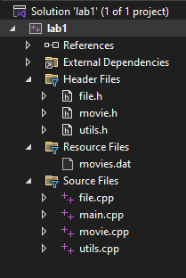

# Workshop #1: Modules, Namespaces
* Version (1.0)

 In process of doing your first workshop you are not any coding but rather organizing an application into modules. Then you will compile each module separately and construct an executable from the results of each compilation.

## Learning Outcomes
Upon successful completion of this workshop, you will have demonstrated the abilities to:

- organize source code into modules, using header and implementation files
- enclose the application in `seneca` namespace
- compile and link modular programs
- distinguish the contents of a header and an implementation file
- describe to your instructor what you have learned in completing this workshop

## Submission Policy and Instructions

This workshop is divided into two sections: a coding part with reflection and a DIY section for practice.

The DIY homework is presented at the end; do it on your own for practice (DIY is neither submitted nor marked).

- Part 1 (**LAB**): A step-by-step guided workshop, worth 100% of the workshop’s total mark.
> Please note that Part 1 **is not** to be started in your lab session of the week. You should start it on your own before the day of your lab and then join the lab session to possibly seek assistance to complete your lab. These workshops must be submitted in the lab to receive 100% of the mark.

- Reflection: A non-coding part, to be submitted a few days later (due date decided by your professor). The reflection doesn’t have marks associated with it but can incur a penalty of up to 40% of the whole workshop’s mark if your professor deems it insufficient (you make your marks from the code, but you can lose some on the reflection).

- Part 2 (**DIY**): A Do It Yourself type of practice that is much more open-ended. This part does not need to be submitted to your professor and does not have any marks tied to it. However, you can always test your program using the automated submitter program or ask your professor for help or feedback.


## Due Dates
### Coding
Part 1 coding is due by the end of your lab session and is to be submitted from one of the desktop computers in the lab for 100% of the mark. You will receive 60% of the mark if you submit your code after the lab by midnight. No submissions are accepted after that.

> You have to submit your code using an SSH terminal client logged into the Matrix cluster from one of the desktop computers in the lab (we recommend using [PuTTY](https://www.putty.org/)). Note that you must only have one connection to the Matrix client; before logging into Matrix to submit your lab, make sure you are logged off all other terminal client sessions.

## Late Penalties
You are allowed to submit your workshop by midnight on the same day of your lab session with a 40% penalty. No submission is accepted after that.


## Citation
Every file that you submit must contain (as a comment) at the top:<br />
**your name**, **your Seneca email**, **Seneca Student ID** and the **date** when you completed the work.

### For work that is done entirely by you (ONLY YOU)

If the file contains only your work or the work provided to you by your professor, add the following message as a comment at the top of the file:

> I have done all the coding by myself and only copied the code that my professor provided to complete my workshops and assignments.

### For work that is done partially by you.

If the file contains work that is not yours (you found it online or somebody provided it to you), **write exactly which part of the assignment is given to you as help, who gave it to you, or which source you received it from.**  By doing this you will only lose the mark for the parts you got help for, and the person helping you will be clear of any wrongdoing.

> - Add the citation to the file in which you have the borrowed code
> - In the 'reflect.txt` submission of part 2 (DIY), add exactly what is added to which file and from where (or whom).

> :warning: This [Submission Policy](#submission-policy-and-instructions) only applies to the workshops. All other assessments in this subject have their own submission policies.

### If you have helped someone with your code

If you have helped someone by providing part of your code. Let them know of these regulations and in your 'reflect.txt' for reflection submission, write exactly which part of your code was copied and who was the recipient of this code.<br />By doing this you will be clear of any wrongdoing if the code recipient does not honour these regulations.


## Compiling and Testing Your Program

All your code should be compiled using this command on `matrix`:

```bash
g++ -Wall -std=c++11 -g -o ws file1.cpp file2.cpp ...
```

- `-Wall`: the compiler will report all warnings
- `-std=c++11`: the code will be compiled using the C++11 standard
- `-g`: the executable file will contain debugging symbols, allowing *valgrind* to create better reports
- `-o ws`: the compiled application will be named `ws`

After compiling and testing your code, run your program as follows to check for possible memory leaks (assuming your executable name is `ws`):

```bash
valgrind --show-error-list=yes --leak-check=full --show-leak-kinds=all --track-origins=yes ws
```

- `--show-error-list=yes`: show the list of detected errors
- `--leak-check=full`: check for all types of memory problems
- `--show-leak-kinds=all`: show all types of memory leaks identified (enabled by the previous flag)
- `--track-origins=yes`: tracks the origin of uninitialized values (`g++` must use `-g` flag for compilation, so the information displayed here is meaningful).

To check the output, use a program that can compare text files.  Search online for such a program for your platform, or use *diff* available on `matrix`.

> Note: All the code written in workshops and the project must be implemented in the **seneca** namespace unless instructed otherwise.


## Submission

### Lab Submission
```bash
~profname.proflastname/submit 2??/wX/lab_sss <ENTER>
```
- Replace **??** with your subject code (`00 or 44`)
- Replace **X** with Workshop number: [`1 to 10`]
- Replace **sss** with the section: [`naa, nbb, nra, zaa, etc...`]

### Reflection Submission
```bash
~profname.proflastname/submit 2??/wX/ref_sss <ENTER>
```
- Replace **??** with your subject code (`00 or 44`)
- Replace **X** with Workshop number: [`1 to 10`]
- Replace **sss** with the section: [`naa, nbb, nra, zaa, etc...`]

### DIY Testing (No Submission)
DIY does not need submission and is for practice only, however, if you want to test your solution you can use the submit command as follows.
 
>This will not submit anything and only tests your program

```bash
~profname.proflastname/submit 2??/wX/diy_sss <ENTER>
```
- Replace **??** with your subject code (`00 or 44`)
- Replace **X** with Workshop number: [`1 to 10`]
- Replace **sss** with the section: [`naa, nbb, nra, zaa, etc...`]


### Custom code submission

If you have any additional custom code, (i.e. functions, classes etc) that you want to reuse in the workshop save them under a module called Utils (`utils.cpp and utils.h`) and submit them with your workshop using the following instructions.

To have your custom Utils module compiled with your workshop, add a **u** to the submission name of your workshop (i.e **u**lab_sss or **u**diy_sss) and issue the submission:

Example:
```bash
~profname.proflastname/submit 2??/wX/ulab_sss  <ENTER>
~profname.proflastname/submit 2??/wX/udiy_sss  <ENTER>
```

- Replace **??** with your subject code (`00 or 44`)
- Replace **X** with Workshop number: [`1 to 10`]
- Replace **sss** with the section: [`naa, nbb, nra, zaa, etc...`]

### Testing
You can always test your code before submission is open (providing your professor makes it available) and after submission is closed using the `-feedback` option:
Example:

```bash
~profname.proflastname/submit 2??/wX/lab_sss -feedback <ENTER>
~profname.proflastname/submit 2??/wX/ulab_sss -feedback <ENTER>
```

### submission options

To see all the options for submission issue the submit command with no arguments

Example:
```bash
~profname.proflastname/submit <ENTER>
```

# Part 1 - LAB (100%)

***50 top movies of all times "genre" search*** is a program that searches through 50 movie records that are saved in a file, based on the user's inquiry on the genre of the movie.

For example, if the user enters *comedy*, the program lists all the movies with *Comedy* in their list of genres.

See the following execution example:

## LAB Execution example

```text
Welcome to 50 top movies of all times "genre" search.

Enter the movie genre to start the search: anim<ENTER>
1- Finding Nemo [2003], G, duration: 100 minutes, Rating: 8.1/10
    (Animation, Adventure, Comedy)
Do another search? (Y)es: y<ENTER>

Enter the movie genre to start the search: comedy<ENTER>
1- Life Is Beautiful [1997], PG, duration: 116 minutes, Rating: 8.6/10
    (Comedy, Drama, Romance)
2- The Intouchables [2011], 14A, duration: 112 minutes, Rating: 8.5/10
    (Biography, Comedy, Drama)
3- My Sassy Girl [2001], PG, duration: 137 minutes, Rating: 8/10
    (Comedy, Drama, Romance)
4- Back to the Future [1985], PG, duration: 116 minutes, Rating: 8.5/10
    (Adventure, Comedy, Sci-Fi)
5- Finding Nemo [2003], G, duration: 100 minutes, Rating: 8.1/10
    (Animation, Adventure, Comedy)
Do another search? (Y)es: n<ENTER>

Goodbye!
```

This program is saved under the file `50BestMovies.cpp`. Your task is to organize this file into three modules:

## Modules
* to be created in step 2 section

### file
This module will contain file-related functions in `file.h` and `file.cpp` files.
### movie
This module will contain movie-related functions in `movie.h` and `movie.cpp` files.
### utils
This module will hold miscellaneous utility functions in `utils.h` and `utils.cpp` files. 
### main 
As already provided; this module will run the main function of the application in `main.cpp` file. This module does not have a header file.

# Step 1:  
*Testing the Excution of the program*

### On Visual Studio
- Open Visual Studio 2022 and create an Empty C++ Windows Console Project:<br />
   - click on `Create a new project`
   - In the `Search for templates` text box you can type `C++` to narrow down the list of available templates
   - form the list select `Empty Project` and click next
   - In the `Project Name` text box type a proper name like `lab1`
   - For location browse to a directory dedicated for your Subject for this semester
   - Leave the solution name empty and ***check*** the `Place solution and project in the same directory` check box.
   - click on create
   This will create a directory for the project called lab1.<br /> Copy the `50BestMovies.cpp` and file `movies.dat` into this directory so It can be added to the project in the next step.
   > You can quickly find this directory by right-clicking on the "lab1" item in Solution Explorer and selecting `Open folder in file explorer`
- In VS, (if not open already) open Solution Explorer (click on View/Solution Explorer) and then add `50BestMovies.cpp` file to your project's source files:<br />
   - Right click on **“Source Files”**<br />
   - Select **“Add/Existing Item”**<br />
   - Select `50BestMovies.cpp` from the file browser<br />
   - Click on **“Ok”**
- Now you can run the program by selecting **“Debug/Start Without Debugging”** or pressing the **“Ctr-F5”** button. 

### On Linux, in your Matrix account or on a Mac computer
- Connect to Seneca with [Global Protect VPN](https://students.senecapolytechnic.ca/spaces/186/it-services/wiki/view/1024/vpn) if you are outside of seneca network.
- Upload `50BestMovies.cpp` and `movies.dat` to your matrix account (Ideally to a designated directory for your workshop solutions). Then, enter the following command to compile the source file and create an executable called ws:
```bash
g++ 50BestMovies.cpp -Wall -std=c++11 -o ws<ENTER>
```
`-Wall`: display all warnings<br />
`-std=c++11`: compile using C++11 standards<br />
`-o ws`:  name the executable ws<br />

- Type the following to run and test the execution:
```bash
ws<ENTER>
```
# Step 2
*Creating the modules*

### On Windows, using Visual Studio (VS)

First of all, remove the `50BestMovies.cpp` file by right-clicking on the file name in Solution Explorer and then selecting remove. Make sure you do not delete the file and only remove it. This will keep the file in the directory but not include it in the compilation process. 

In Solution Explorer, add the three new modules to your project as stated in the [Modules](#modules) section.

Add the header files by right-clicking on the `Header Files` and then selecting `Add/New Item` in the Solution Explorer. Also, add the `CPP` files in the same way but by right-clicking on `Source Files`.

You can always add the files that belong to the project but are not part of the compilation by adding them to the `Resource Files` section. (i.e. `movies.dat` etc...) 

The main module has an implementation (.cpp) file but no header file. Add this as an existing item to the source files.

Your solution explorer now should look like this:<br />


Now add the compilation safeguards to all the header files.

Then Add the `seneca` namespace to all the files except `main.cpp`, since main uses the `seneca` namespace and will not implement it.

Your header files should look like as follows:

Assuming your header file is called `abc.h`

```c++
#ifndef SENECA_ABC_H_
#define SENECA_ABC_H_
namespace seneca {
   
}
#endif // !SENECA_ABC_H_

```

Your CPP files (except `main.cpp`) should look like as follows:

Assuming your cpp file is called `abc.cpp`

```c++
#include "abc.h"
namespace seneca {

}
```

> You will use this pattern to create all the modules during the semester in all workshops, projects and assessments.


> **Important**: Note that you are not allowed to use the `using` statement in a header file.<br />
For example, in a header file you are not allowed to write:
```c++
using namespace std; // not allowed in a ".h" file
```

### Compilation Safeguards explanation

- **Compilation Safeguards** refer to a technique to guard against multiple inclusion of header files. It does so by applying macros that check against a defined name:

```c++
#ifndef NAMESPACE_HEADERFILENAME_H // replace with relevant names
#define NAMESPACE_HEADERFILENAME_H

// Your header file content goes here

#endif
```
If the name isn't yet defined, the **#ifndef** will allow the code to proceed onward to then define that same name. Following that the header is then included. If the name is already defined, meaning the file has been included prior (otherwise the name wouldn’t have been defined), the check fails, the code proceeds no further and the header is not included again.<br />
Compilation safeguards prevent multiple inclusions of a header in a module. They do not protect against including the header again in a different module (remember that each module is compiled independently from other modules).<br />
Additionally, here is an instructional video showing how the compiler works and why you need these safeguards in all of your header files. Do note that this video describes the intent and concept behind safeguards, the naming scheme isn’t the standard for our class. Follow the standard for safeguards as described in your class.<br />
[Compilation Safegards](https://www.youtube.com/watch?v=EGak2R7QdHo): https://www.youtube.com/watch?v=EGak2R7QdHo

# Step 3:

### Populating the modules with functions

Separate all the functions in `50BestMovies.cpp` except the main function by copying them into their corresponding modules.

### Function and structure placement and Inclusion guidelines in creating modules
- Add the structure definitions to the corresponding header files
- Add the prototype of the functions to the corresponding header files (inside the namespace)
- Add the body of functions inside the namespace for each module. 
- DO NOT include header files in a header file unless needed.
- Include only the needed header files in the cpp file. Avoid random (just-in-case) inclusions.
- Add global (file-scope) variables to the cpp files and not the header file

## Function placements
### utils module
Functions:
```
flushkeys
yes
toLowerCase
```
Make sure `utils.cpp` includes the header file necessary for 'cin' and therefore uses the `std` namespace.

### file module
Functions:
```
openFile
closeFile
readTitle
readYear
readMovieRating
readDuration
readGenres
readConsumerRating
```
Make sure `file.cpp` mutes the CRT_SECURE warnings by applying `#define _CRT_SECURE_NO_WARNINGS`.

Also, include the header file needed for `fscanf`.

Add the global `FILE* fptr;` above all of the functions inside the namespace. 

### movie module
Definitions:
```
struct Movie
```
Add the complete definition of the `Movie` structure to the namespace in the header file.

Functions:
```
loadMovies
hasGenre
displayMovie
displayMoviesWithGenre
```

As with `file.cpp`, `movie.cpp` mutes the CRT_SECURE warnings.

`movie.cpp` also requires including the library header files for usage of `cout` and the `strstr` function.

Make sure all header files for file and utility operators are included. 

> Standard library header files must always be included before the custom header files.

Add the global array of 50 Movies above all of the functions inside the namespace. 

# Step 4
*Test the modules*
To test that you have done this correctly, you can compile each module separately, by right-clicking on `file.cpp`, `movie.cpp`, `utils.cpp` and `main.cpp` separately and selecting compile from the menu. If the compilation is successful, most likely you have done it correctly. 

> Note that this only compiles individual files into a binary object code and will not generate an executable

The equivalent of this on matrix or Mac is to add -c to the compile command:
```Bash
g++ file.cpp –Wall -std=c++11 –c<ENTER>
```
This example will only compile `file.cpp` and will not create an executable. If the compilation is successful you will notice a new object file called `file.o` is generated, that is the compilation result of `file.cpp`.

> When building the project (compiling without `-c`) the compiles links all these binary object files into an executable file.

# Step 5
*Compile and run the program*

Now Compile and run the project (as you did before in Step 1) and make sure everything works.

On Linux, in your matrix account, upload the module files (`file.cpp`, `File.h`, `movie.cpp`, `movie.h`, `utils.cpp`, `utils.h` and `main.cpp` ) and the data file `movies.dat` to your matrix account and compile the source code using the following command.
```Bash
g++ utils.cpp file.cpp movie.cpp main.cpp -Wall -std=c++11 -o ws<ENTER>
```
Run the program like before making sure that everything still works properly. 

## The tester program.
[main.cpp](./lab/main.cpp)

## Expected output

[correct_output.txt](./lab/correct_output.txt)

## LAB Submission (part 1)

### Files to submit:  
```Text
utils.cpp
utils.h
file.cpp
file.h
movie.cpp
movie.h
main.cpp
```

### Data Entry

```
abc
y
com
y
fan
n
```

### Submission Process


Upload your source code to your `matrix` account. Compile and run your code using the `g++` compiler as shown in [Compiling and Testing Your Program](#compiling-and-testing-your-program) and make sure that everything works properly.

Then, run the submission command from your matrix account


> **⚠️Important:** Please note that a successful submission does not guarantee full credit for this workshop. If the professor is not satisfied with your implementation, your professor may ask you to resubmit. Re-submissions will attract a penalty.

## Reflection

Study your final solutions for each deliverable of the workshop, reread the related parts of the course notes, and make sure that you have understood the concepts covered by this workshop.  **This should take around 30 minutes of your time and the result is suggested to be at least 150 words in length.**

Create a file named `reflect.txt` that contains your detailed description of the topics that you have learned in completing this workshop and mention any issues that caused you difficulty.

You may be asked to talk about your reflection (as a presentation) in class.

### Reflection Submission.
Transfer your `reflect.txt` to the matrix cluster and issue the submit command.


# DIY workshop (Practice only)

Use your lab as a blueprint and create an application for a phone directory search for the provided comma-separated data file in three modules: `utils`, `file`, `phone` and `main`.

Your program should run like this:

```text
Phone Directory Search
35 records loaded!

Enter partial contact name
> luc
No match found for: luc
Do another search? (Y)es: y

Enter partial contact name
> luk
1- Luke Skywalker (301) 555 630
Do another search? (Y)es: n
Goodbye!
```

If you would like your application to be tested by the submit command you need to have at least the following functions:

- `phone` module:<br />
`int loadPhones();` // Loads the phone records, returning the number of records read<br />
`void displayMatchingNames(const char* partialName);` // lists matching records from the phone directory
- `utils` module:<br />
`char* getName(char* partialName)  ;` // reads the partial name from the console using a proper prompt and places it `partialName` cstring, and returns `partialName`<br />
`bool yes();` returns true if `'y'` or `'Y'` are entered; 
## The tester program.
[main.cpp](DIY/main.cpp)

## Expected output

[correct_output.txt](DIY/correct_output.txt)

## DIY Testing

### Files needed to test with the submit command:  
```Text
utils.cpp
utils.h
file.cpp
file.h
phone.cpp
phone.h
main.cpp
```

### Data Entry

```text
luc
y
luk
y
l
n
```

### Testing Process


Upload your source code to your `matrix` account. Compile and run your code using the `g++` compiler as shown in [Compiling and Testing Your Program](#compiling-and-testing-your-program) and make sure that everything works properly.

Then, run the submit command from your matrix account to test the execution of your DIY section.
