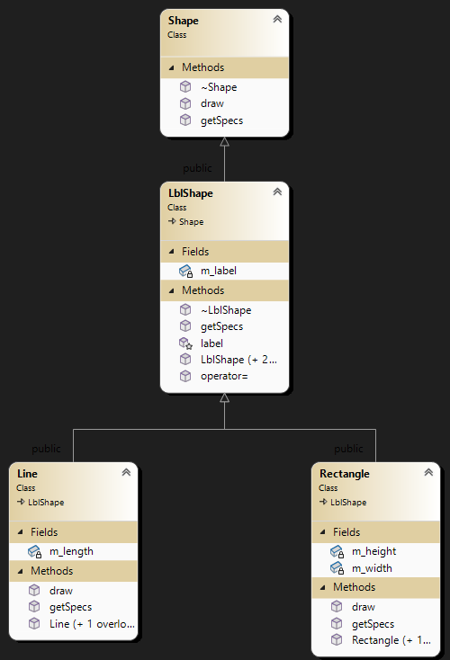

### Workshop #8: Virtual Functions and Abstract Base Classes

In this workshop, you will create a hierarchy of classes to practice and understand the role of virtual functions in inheritance.  
The workshop consists of 4 classes:

- **Shape**: Encapsulates a shape that can be drawn on the screen  
  *(An interface, serving as an abstract base class with only pure virtual functions)*

- **LblShape**: Encapsulates a shape that can be labeled  
  *(An abstract base class that represents a labeled shape)*

- **Line**: Encapsulates a horizontal line on a screen with a label  
  *(This concrete class draws a labeled line)*

- **Rectangle**: Encapsulates a rectangle on the screen that can be labeled  
  *(This concrete class draws a rectangle with a label inside)*

### Learning Outcomes

Upon successful completion of this workshop, you will have demonstrated the abilities to:

- Define pure virtual functions
- Create abstract base classes
- Implement behavior using virtual functions
- Explain the difference between an abstract base class and a concrete class
- Reflect on what you have learned in completing this workshop


## Submission Policy and Instructions

This workshop is divided into two sections: a coding part with reflection and a DIY section for practice.

The DIY homework is presented at the end; do it on your own for practice (DIY is neither submitted nor marked).

- Part 1 (**LAB**): A step-by-step guided workshop, worth 100% of the workshop’s total mark.
> Please note that Part 1 **is not** to be started in your lab session of the week. You should start it on your own before the day of your lab and then join the lab session to possibly seek assistance to complete your lab. These workshops must be submitted in the lab to receive 100% of the mark.

- Reflection: A non-coding part, to be submitted a few days later (due date decided by your professor). The reflection doesn’t have marks associated with it but can incur a penalty of up to 40% of the whole workshop’s mark if your professor deems it insufficient (you make your marks from the code, but you can lose some on the reflection).

- Part 2 (**DIY**): A Do It Yourself type of practice that is much more open-ended. This part does not need to be submitted to your professor and does not have any marks tied to it. However, you can always test your program using the automated submitter program or ask your professor for help or feedback.


## Due Dates
### Coding
Part 1 coding is due by the end of your lab session and is to be submitted from one of the desktop computers in the lab for 100% of the mark. You will receive 60% of the mark if you submit your code after the lab by midnight. No submissions are accepted after that.

> You have to submit your code using an SSH terminal client logged into the Matrix cluster from one of the desktop computers in the lab (we recommend using [PuTTY](https://www.putty.org/)). Note that you must only have one connection to the Matrix client; before logging into Matrix to submit your lab, make sure you are logged off all other terminal client sessions.

## Late Penalties
You are allowed to submit your workshop by midnight on the same day of your lab session with a 40% penalty. No submission is accepted after that.


## Citation
Every file that you submit must contain (as a comment) at the top:<br />
**your name**, **your Seneca email**, **Seneca Student ID** and the **date** when you completed the work.

### For work that is done entirely by you (ONLY YOU)

If the file contains only your work or the work provided to you by your professor, add the following message as a comment at the top of the file:

> I have done all the coding by myself and only copied the code that my professor provided to complete my workshops and assignments.

### For work that is done partially by you.

If the file contains work that is not yours (you found it online or somebody provided it to you), **write exactly which part of the assignment is given to you as help, who gave it to you, or which source you received it from.**  By doing this you will only lose the mark for the parts you got help for, and the person helping you will be clear of any wrongdoing.

> - Add the citation to the file in which you have the borrowed code
> - In the 'reflect.txt` submission of part 2 (DIY), add exactly what is added to which file and from where (or whom).

> :warning: This [Submission Policy](#submission-policy) only applies to the workshops. All other assessments in this subject have their own submission policies.

### If you have helped someone with your code

If you have helped someone by providing part of your code. Let them know of these regulations and in your 'reflect.txt' for reflection submission, write exactly which part of your code was copied and who was the recipient of this code.<br />By doing this you will be clear of any wrongdoing if the code recipient does not honour these regulations.


## Compiling and Testing Your Program

All your code should be compiled using this command on `matrix`:

```bash
g++ -Wall -std=c++11 -g -o ws file1.cpp file2.cpp ...
```

- `-Wall`: the compiler will report all warnings
- `-std=c++11`: the code will be compiled using the c++11 standard
- `-g`: the executable file will contain debugging symbols, allowing *valgrind* to create better reports
- `-o ws`: the compiled application will be named `ws`

After compiling and testing your code, run your program as follows to check for possible memory leaks (assuming your executable name is `ws`):

```bash
valgrind --show-error-list=yes --leak-check=full --show-leak-kinds=all --track-origins=yes ws
```

- `--show-error-list=yes`: show the list of detected errors
- `--leak-check=full`: check for all types of memory problems
- `--show-leak-kinds=all`: show all types of memory leaks identified (enabled by the previous flag)
- `--track-origins=yes`: tracks the origin of uninitialized values (`g++` must use `-g` flag for compilation, so the information displayed here is meaningful).

To check the output, use a program that can compare text files.  Search online for such a program for your platform, or use *diff* available on `matrix`.

> Note: All the code written in workshops and the project must be implemented in the **seneca** namespace unless instructed otherwise.

## Submission

### Lab Submission
```bash
~profname.proflastname/submit 2??/wX/lab_sss <ENTER>
```
- Replace **??** with your subject code (`00 or 44`)
- Replace **X** with Workshop number: [`1 to 10`]
- Replace **sss** with the section: [`naa, nbb, nra, zaa, etc...`]

### Reflection Submission
```bash
~profname.proflastname/submit 2??/wX/ref_sss <ENTER>
```
- Replace **??** with your subject code (`00 or 44`)
- Replace **X** with Workshop number: [`1 to 10`]
- Replace **sss** with the section: [`naa, nbb, nra, zaa, etc...`]

### DIY Testing (No Submission)
DIY does not need submission and is for practice only, however, if you want to test your solution you can use the submit command as follows.
 
>This will not submit anything and only tests your program

```bash
~profname.proflastname/submit 2??/wX/diy_sss <ENTER>
```
- Replace **??** with your subject code (`00 or 44`)
- Replace **X** with Workshop number: [`1 to 10`]
- Replace **sss** with the section: [`naa, nbb, nra, zaa, etc...`]


### Custom code submission

If you have any additional custom code, (i.e. functions, classes etc) that you want to reuse in the workshop save them under a module called Utils (`utils.cpp and utils.h`) and submit them with your workshop using the following instructions.

To have your custom Utils module compiled with your workshop, add a **u** to the submission name of your workshop (i.e **u**lab_sss or **u**diy_sss) and issue the submission:

Example:
```bash
~profname.proflastname/submit 2??/wX/ulab_sss  <ENTER>
~profname.proflastname/submit 2??/wX/udiy_sss  <ENTER>
```

- Replace **??** with your subject code (`00 or 44`)
- Replace **X** with Workshop number: [`1 to 10`]
- Replace **sss** with the section: [`naa, nbb, nra, zaa, etc...`]

### Testing Your lab before submission opens
You can always test your code before submission is open (providing your professor makes it available) and after submission is closed using the `-feedback` option:


Example:
```bash
~profname.proflastname/submit 2??/wX/lab_sss -feedback <ENTER>
~profname.proflastname/submit 2??/wX/ulab_sss -feedback <ENTER>
```

### submission options

To see all the options for submission issue the submit command with no arguments

Example:
```bash
~profname.proflastname/submit <ENTER>
```

# Part 1 - LAB (100%) 
Implement four modules for the following classes: **Shape, LblShape, Line**, and **Rectangle**.



## 1 - The `Shape` Interface

### Create the following two [Pure Virtual Functions](https://intro2oop.sdds.ca/E-Polymorphism/abstract-base-classes#pure-virtual-function):

> A [pure virtual function](https://intro2oop.sdds.ca/E-Polymorphism/abstract-base-classes#pure-virtual-function) is a virtual function that has no implementation. To indicate that the pure virtual function does not have an implementation, set its prototype to zero (`= 0;`) in the class declaration.

#### `draw`
Define `draw` as a pure virtual function that returns `void` and accepts a reference to an **ostream** object as an argument. This function should not modify the current object (should be a const function).

#### `getSpecs`
Define `getSpecs` as a pure virtual function that returns `void` and accepts a reference to an **istream** object as an argument.

### Destructor
Create a virtual empty destructor for the `Shape` interface.
> This ensures that any dynamically allocated derived class from the `Shape` interface, when pointed to by a base class pointer, will be properly removed from memory when deleted.

### `Shape` Helper Functions
Overload the insertion (`<<`) and extraction (`>>`) operators to work with any `Shape` object using the `draw` and `getSpecs` pure virtual functions. This allows any derived `Shape` object to be written to or read from an **ostream** and **istream**.


## 2 - The `LblShape` Abstract Class (the Labeled Shape class)

Define an abstract class `LblShape` that inherits from the `Shape` interface. This class adds a label to a `Shape`.

The `LblShape` class will implement the pure virtual function **getSpecs** but will not implement **draw**. As a result, it remains an abstract class.

### Private Member Variable
- **m_label**: Add a character pointer member variable named `m_label` and initialize it to `nullptr`. This member variable will be used to hold the dynamically allocated label for the `Shape`.

### Protected Members
- **label()**: Add a query function named `label` that returns an unmodifiable pointer to `m_label`. This function is protected, allowing only descendants of `LblShape` to access the label.

### Public Members
#### Default (No-Argument) Constructor
Sets the `m_label` pointer to `nullptr`. (Note: If `m_label` is already initialized to `nullptr`, no additional action is required.)

#### One-Argument Constructor
Allocates memory large enough to hold the incoming C-string argument and assigns it to `m_label`. Then, copies the C-string argument to the newly allocated memory using `Utils::alocpy()`.

#### Destructor
Deletes the memory allocated for `m_label` to ensure there is no memory leak.

#### Deleted Actions (Rule of three)
Delete the copy constructor and assignment operator to prevent copying or assignment of `LblShape` instances.

#### getSpecs
Override the `Shape::getSpecs` pure virtual function to read a comma-delimited C-string from `istream`:

1. Extract up to 80 characters or until a **','** character is encountered, then ignore the comma. (use `istream::getline()`)
2. Re-allocate memory to hold the extracted C-string and copy it to the newly allocated memory using `Utils::alocpy()`.


## 3 - The `Line` Concrete Class

The `Line` class inherits from `LblShape` to create a horizontal line with a label.

### Private Member Variable
- **m_length**: A member variable to hold the length of the line in characters.

### Public Members

#### Default (No-Argument) Constructor
- Initializes `m_length` to zero and invokes the default constructor of the base class.

#### Two-Argument Constructor
- Accepts a `const char*` (label) and an integer (length) as arguments.
- Passes the label to the base class constructor and assigns the integer value to `m_length`.
- If the specified `m_length` is less than the length of the label, `m_length` is set to the length of the label.

#### Destructor
- This class does not require a destructor.

#### getSpecs
- This function overrides the `getSpecs` function of the base class to read comma-separated specifications for the `Line`:

  1. First, calls the base class’s `getSpecs` function to read the label.
  2. Then, reads the value of `m_length` from the `istream` argument.
  3. Ignores the rest of the characters up to and including the newline character (`'\n'`).

#### draw
- This function overrides the `draw` function of the base class to draw a labeled line:

  - If `m_length` is greater than zero and `label()` is not null:
    1. Prints the `label()`, then moves to a new line.
    2. Prints the `=` character repeatedly up to the value of `m_length`.
  - If either condition is not met, the function performs no action.

For example, if the C-string returned by `label()` is `"Separator"` and `m_length` is `40`, the `draw` function should output the following to `ostream`:

```Text
Separator
========================================
```

This section provides detailed instructions for implementing the `Rectangle` class. Here’s a refined version with a few tweaks for clarity and accuracy:

---

## 3 - The `Rectangle` Concrete Class

The `Rectangle` class inherits from `LblShape` to create a rectangular frame with a label inside.

### Private Member Variables
- **m_width**: Holds the width of the rectangular frame (in characters).
- **m_height**: Holds the height of the rectangular frame (in characters).

### Public Members

#### Default (No-Argument) Constructor
- Initializes `m_width` and `m_height` to zero and invokes the default constructor of the base class.

#### Three-Argument Constructor
- Accepts a `const char*` for the label, an integer for width, and an integer for height.
- Passes the label to the base class constructor and assigns the width and height values to `m_width` and `m_height`.
- If `m_height` is less than 3, set `m_height` to 3.
- If `m_width` is less than the length of `label() + 2`, set `m_width` to `label() + 2`.

#### Destructor
- This class does not require a destructor.

#### getSpecs
- This function overrides the `getSpecs` function of the base class to read comma-separated specifications for the `Rectangle`:

  1. Calls the base class’s `getSpecs` function to read the label.
  2. Reads `m_width` from `istream`, skips the comma, and reads `m_height`.
  3. Ignores the rest of the characters up to and including the newline character (`'\n'`).

#### draw
- This function overrides the `draw` function of the base class. If the rectangle is not empty (i.e., `m_width` > 0 and `m_height` > 0), it will draw the frame with the label inside. If either dimension is zero, the function performs no action.

  - **First Line**: Prints `+`, followed by `m_width - 2` `-` characters, then `+` again, and moves to a new line.
  
  - **Second Line**: Prints `|`, followed by `label()` left-justified within `(m_width - 2)` spaces, followed by `|`, and moves to a new line.
  
  - **Next `(m_height - 3)` Lines**: Prints `|`, fills `(m_width - 2)` spaces, then prints `|`, and moves to a new line.
  
  - **Last Line**: Exactly like the first line, prints `+`, followed by `m_width - 2` `-` characters, and then `+`.


For example, if the `label()` returns `"Container"`, `m_width` is 30, and `m_height` is 5, the `draw` function should output:

```Text
+----------------------------+
|Container                   |
|                            |
|                            |
+----------------------------+
```

> You could use `ostream::width()` and `ostream::fill()` to set the width and fill characters effectively, allowing you to print the rectangle with only one loop for the empty lines:

```Text
Using width and fill:
- Print the first line
- Print the label left justified between two `|` characters in the second line
- Use a loop to print the empty lines
- Complete the rectangle by printing the last line
```


## The tester program.
[main.cpp](lab/main.cpp)

## Expected output
[correct_output.txt](lab/correct_output.txt)

## LAB Submission (part 1)
Files to submit:  
```Text
Shape.h
Shape.cpp
LblShape.h
LblShape.cpp
Line.h
Line.cpp
Rectangle.h
Rectangle.cpp
main.cpp
```
### Data Entry

Follow the instrutions of the unit test.

### Submission Process


Upload your source code to your `matrix` account. Compile and run your code using the `g++` compiler as shown in [Compiling and Testing Your Program](#compiling-and-testing-your-program) and make sure that everything works properly.

Then, run the submission command from your matrix account


#### Submitting Utils Module

If you have any custom code in your Utils module from previous workshops, include it in the Utils module for this submission. For this workshop, submitting the Utils module is mandatory and it is included with normal submission.


> **⚠️Important:** Please note that a successful submission does not guarantee full credit for this workshop. If the professor is not satisfied with your implementation, your professor may ask you to resubmit. Re-submissions will attract a penalty.

## Reflection

Study your final solutions for each deliverable of the workshop, reread the related parts of the course notes, and make sure that you have understood the concepts covered by this workshop.  **This should take around 30 minutes of your time and the result is suggested to be at least 150 words in length.**

Create a file named `reflect.txt` that contains your detailed description of the topics that you have learned in completing this workshop and mention any issues that caused you difficulty.

You may be asked to talk about your reflection (as a presentation) in class.

### Reflection Submission.
Transfer your `reflect.txt` to the matrix cluster and issue the submit command.

# DIY  

No DIY this time!

Work on your project code instead.